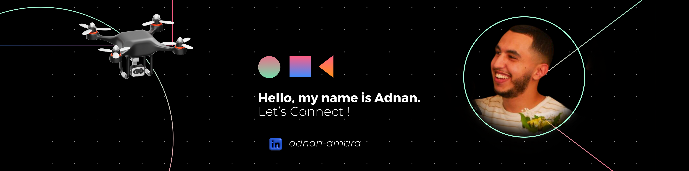

## Hi 👋, I'm an Electronics and Embedded Systems engineer

  
  
   

- 🤖 I'm learning prompt engineering 
- 👀 I’m interested in Hardware hacking, Robotics, embedded systems, cryptography and ML
- 🌱 I believe that autonomous driving should not be limited to high-end vehicles,so I'm looking forward to develop retrofit kits that can be installed on existing cars to make them autonomous
- 📄 I’m looking to collaborate on a research paper

  

  

### Connect with me

    
    
    

